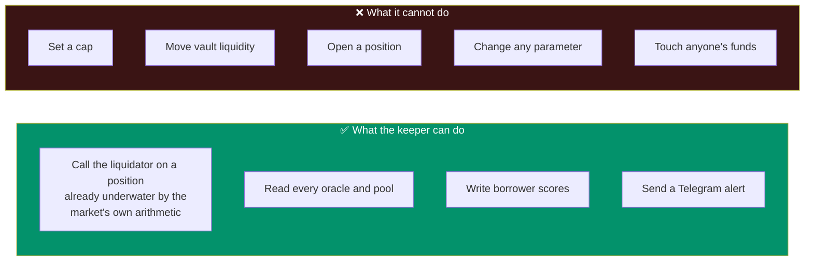
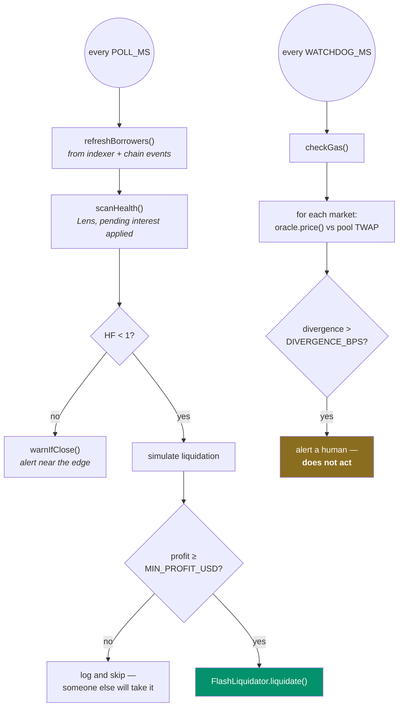

<h1 align="center">cluby-keeper</h1>

<p align="center">
  <b>The watchdog that can only subtract.</b><br>
  It liquidates positions already underwater, compares every oracle against live trading, and wakes a human. It cannot do anything else.
</p>

<p align="center">
  
  
  
  <a href="LICENSE"></a>
</p>

---

## What it can and cannot do

This is the part worth reading if you are deciding whether to trust the protocol.



**It is not an allocator on the vault.** Every power it has reduces exposure. Withdrawing a cap is a
decision the Safe makes, in public, behind a 24-hour timelock.

> The tempting design is a keeper that pulls liquidity automatically at 3am and tells you in the
> morning. That is also a key on a server with the authority to drain a vault into a market of its
> choosing. We would rather be woken up.

Without `KEEPER_PK` it still runs — watching and alerting, signing nothing.

---

## The two passes



Divergence sits between **0 and 112 basis points** per market in normal operation.

---

## Three things learned by being paged at 4am

### A transport failure is not a broken market

The first version wrote `.catch(() => null)` around every read. That erased the difference between
*the RPC is down* and *this market is broken* — and then alerted **per market**. One flaky endpoint
produced **96 Telegram messages in an hour**, none of which said what was actually wrong.

```ts
export function isTransportFailure(e: unknown): boolean {
  const text = String(e?.shortMessage ?? e?.message ?? e);
  return /HTTP request failed|RPC Request failed|fetch failed|timed out|ETIMEDOUT|ECONNRESET|ENOTFOUND|socket hang up|502|503|504|429/i.test(text);
}
```

Transport failures are now collapsed into **one** alert at the end of the pass. Contract errors stay
attributed to the market that raised them.

### An alert that never says "it's fine again" trains you to ignore it

`recovered()` speaks only if a matching alert actually went out. No noise on a clean start, and no
silent recovery after a real one.

### A quiet keeper and a wedged keeper produce the same log — nothing

```
alive: 47 borrower(s) watched, 3 with debt, worst HF 1.8412
```

One heartbeat line every five minutes, carrying the two numbers an operator would otherwise have to
go and look up.

---

## Running it

```bash
pnpm install
RPC_URL=<rpc> pnpm start           # watch + liquidate
RPC_URL=<rpc> pnpm watch-only      # no KEEPER_PK: watch + alert, sign nothing
```

| Variable | Required | What it does |
|---|---|---|
| `RPC_URL` | ✅ | Primary node |
| `RPC_URL_FALLBACK` | | Secondary, used automatically when the primary fails |
| `KEEPER_PK` | | Without it the keeper never signs |
| `LENS_ADDR` / `FLASH_LIQ_ADDR` | | Override the deployed addresses |
| `PONDER_URL` | | Indexer, for the borrower set. Optional — falls back to chain events |
| `TELEGRAM_TOKEN` / `TELEGRAM_CHAT` | | Where alerts go |
| `DIVERGENCE_BPS` | | Watchdog tolerance, default 150 |
| `MIN_PROFIT_USD` | | Below this it does not bother |
| `POLL_MS` / `WATCHDOG_MS` / `HEARTBEAT_MS` | | Cadence |

A `fallback()` transport is wired in `env.ts`: the free public node is tried first and the paid
archive is the backup, which is the right order when the reads are near the chain tip.

Deployment units are in [`clubytech/cluby`](https://github.com/clubytech/cluby) under `ops/systemd/`.

---

## Layout

```
src/index.ts       the two passes and the heartbeat
src/liquidate.ts   scanHealth, tryLiquidate, warnIfClose
src/watchdog.ts    oracle vs pool, per market, collapsed transport errors
src/borrowers.ts   who to watch — indexer, with a chain-event fallback
src/alerts.ts      Telegram, isTransportFailure, recovered
src/scores.ts      writes borrower scores to the CreditRegistry
src/revert.ts      decodes a revert into something a human can read
src/env.ts         config, clients, the fallback transport
src/facts.ts       protocol constants for alert text
vendor/            @cluby/config, @cluby/abi, @cluby/sdk
```

---

## Part of Cluby

| Repository | What it holds |
|---|---|
| **cluby-keeper** | ← you are here |
| [cluby-liquidator](https://github.com/clubytech/cluby-liquidator) | The contract this calls |
| [cluby-oracles](https://github.com/clubytech/cluby-oracles) | What the watchdog compares against trading |
| [cluby-lens](https://github.com/clubytech/cluby-lens) | Where the health factors come from |
| [cluby-incentives](https://github.com/clubytech/cluby-incentives) | Where the scores are written |
| [cluby-sdk](https://github.com/clubytech/cluby-sdk) | Typed reads shared with the site |

[cluby.cash](https://cluby.cash) · [@ClubyTech](https://x.com/ClubyTech)
